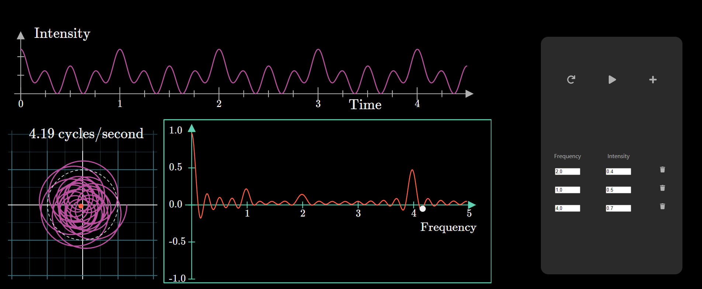

# Fourier Transform Animation

This is an interactive implementation of an animation made originally design by **Grant Sanderson** ([@3b1b](https://github.com/3b1b)) in his [video](https://www.youtube.com/embed/spUNpyF58BY).
It's **still in progress** so it may not fully work.

## Screenshot of the animation :

## License

The original design was created by <a href="https://github.com/3b1b"> Grant Sanderson </a> and is licensed under the <a href="https://creativecommons.org/licenses/by-nc-sa/2.0/"> Creative Commons Attribution-NonCommercial-ShareAlike 2.0 Generic (CC BY-NC-SA 2.0) </a>.

This is MIT licensed (see [LICENSE.md](LICENSE.md))
